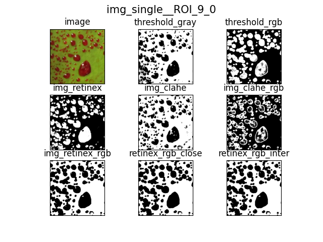
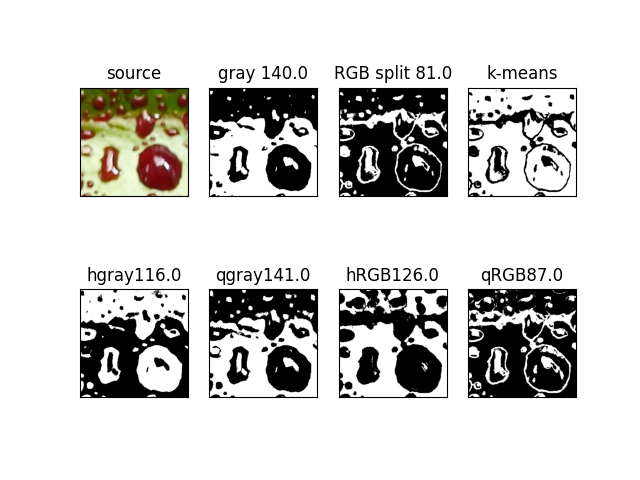
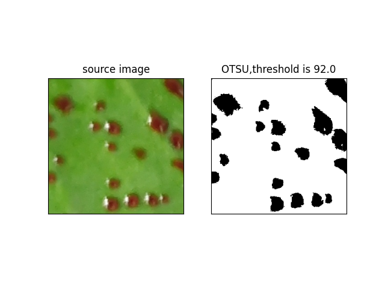
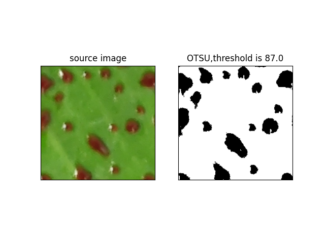
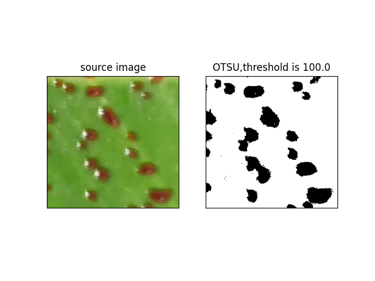
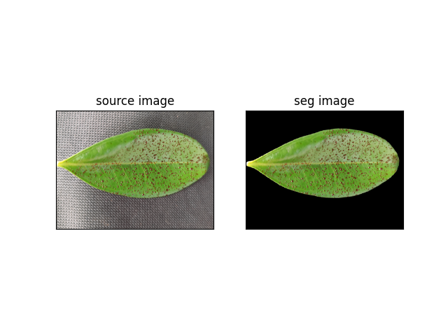
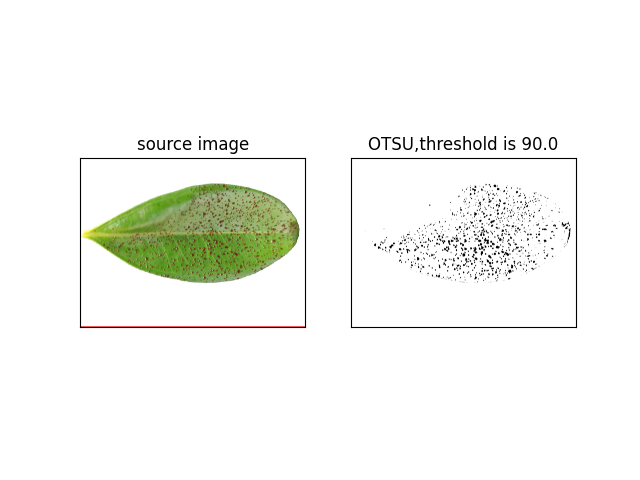

2023.7.12  
通过seg切割叶片，并且提取mask区域，对mask区域做随机裁切，裁切的图像可以OTSU阈值处理，对于叶片只能用固定阈值处理，因为叶片周围还是有黑色背景，OTSU会将这部分算进去。

2023.7.14  
rangROI.py 通过fastsam提取叶片mask区域，对mask区域做随机裁切  
disposeROI.py 对图像做阈值化处理，增加通道分离的预处理，能够一定程度弥补二值化缺失的反射光区域。统计了轮廓的个数和面积  
K-means.py 对雾滴进行K-means聚类。  

2023.7.19 
rangROIs.py 批量读取图像，每张图像叶片切割出10张并分别保存  
disposeROIs.py 批量进行处理， 直方图均衡化、Retinex算法进行预处理光照， 直接灰度和通道分离进行OSTU阈值化， plt显示并保存  

2023.7.20
增加轮廓的最大邻接矩形，将截取的区域限制在最大邻接矩形内（还是存在区域外的情况）  
对代码进行简单封装  
对轮廓进行填充

